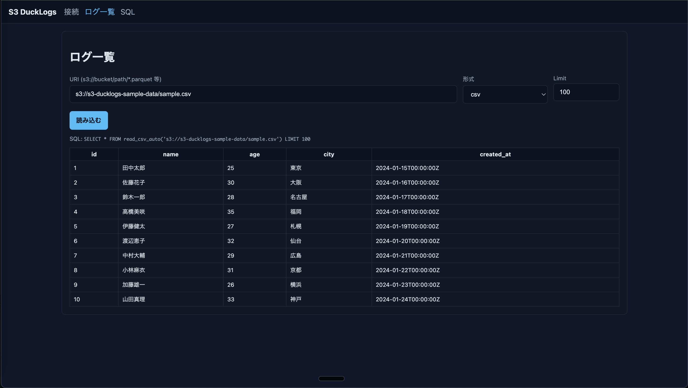

# S3 DuckLogs

A lightweight S3 log viewer MVP. Using DuckDB's httpfs extension to directly read Parquet/JSONL/CSV files from S3/compatible storage, with a React UI for browsing, searching, and SQL execution.

## Features

- Zero-dependency feel: Instant startup with Docker / Works as Go single binary
- Backend: Go 1.24 + net/http + go-duckdb
- DuckDB: Install/LOAD httpfs for direct S3 access (using AWS_* environment variables)
- Frontend: React + Vite + TypeScript (minimal UI)

## Directory Structure

```
s3-ducklogs/
├─ backend/
│  ├─ main.go
│  ├─ go.mod
│  ├─ Dockerfile
├─ frontend/
│  ├─ index.html
│  ├─ vite.config.ts
│  ├─ package.json
│  └─ src/
│     ├─ main.tsx
│     ├─ api.ts
│     ├─ App.tsx
│     └─ pages/
│        ├─ Connect.tsx
│        ├─ Logs.tsx
│        └─ SQL.tsx
├─ docker-compose.yml
├─ README.md
└─ LICENSE
```

## Prerequisites

- Docker / docker-compose available
- AWS credentials provided via environment variables (AWS_ACCESS_KEY_ID, AWS_SECRET_ACCESS_KEY, optionally AWS_SESSION_TOKEN, AWS_REGION)

## Setup & Startup

1) Repository setup

- First time: git clone and move to directory

2) Start with Docker

```bash
# Set AWS_* on host
export AWS_ACCESS_KEY_ID=...
export AWS_SECRET_ACCESS_KEY=...
export AWS_REGION=ap-northeast-1   # optional

# Start
docker compose up --build
```

- Backend: <http://localhost:8080>
- Frontend: <http://localhost:5173>

3) Start with Go standalone (optional)

```bash
cd backend
# DuckDB library required (Debian/Ubuntu: sudo apt install libduckdb-dev libduckdb0)
go run .
```

## Sample Data

Test sample data is available in sample_data:

### Available Files

| File | Format | Size | Description |
|------|--------|------|-------------|
| `sample.csv` | CSV | 392B | 10 user records (id, name, age, city, created_at) |
| `sample.json` | JSON | 1.1KB | 5 detailed user records (skills, active status, score) |
| `sample.parquet` | Parquet | 5.3KB | 10 user records (salary, department, manager info) |

### Sample Data Usage Examples

```sql
-- CSV file reading
SELECT * FROM read_csv_auto('s3://s3-ducklogs-sample-data/sample.csv') LIMIT 5;

-- JSON file reading
SELECT name, skills FROM read_json_auto('s3://s3-ducklogs-sample-data/sample.json') WHERE active = true;

-- Parquet file reading
SELECT name, department, salary FROM read_parquet('s3://s3-ducklogs-sample-data/sample.parquet') WHERE is_manager = true;
```


*Screen showing JSON file loaded from S3*


*Screen showing CSV file loaded from S3*


*Screen showing Parquet file loaded from S3*

## Frontend Usage

- Screen A "Connect": Enter Region/Endpoint and apply
- Screen B "Log List": Specify s3:// format URI, format, and Limit for loading
- Screen C "SQL": Execute arbitrary SQL

## API List (MVP)

- POST /connect
  - Input example: {"s3_region":"ap-northeast-1","s3_endpoint":"optional"}
  - Action: Configure httpfs in DuckDB (SET s3_region/s3_endpoint)
  - Output: {"ok":true,"message":"httpfs configured"}

- POST /quick
  - Input example: {"uri":"s3://bucket/logs/*.parquet","format":"parquet","limit":100}
  - Action: Read using read_parquet / read_json_auto / read_csv_auto and return LIMIT records
  - Output example: {"rows":[...],"columns":[...],"sql":"executed SQL"}

- POST /query
  - Input example: {"sql":"SELECT * FROM ... LIMIT 10"}
  - Action: Execute arbitrary SQL and return results
  - Output example: {"rows":[...],"columns":[...]}

### Health Check

- GET /health -> {"status":"ok","time":"..."}

## Design Notes

- DuckDB executes `INSTALL httpfs; LOAD httpfs;` on server startup
- Authentication: DuckDB automatically references AWS_* environment variables
- Database created in memory (shared within single process). Can be changed to file persistence if needed
- CORS: Simple allowance (for browser access). Restriction recommended for production use

## FAQ

- JSONL specification: Any of format=json/jsonl/ndjson works (using read_json_auto)
- For MinIO etc. S3-compatible: Specify endpoint, and set `AWS_REGION` if needed

## License

This project is licensed under the MIT License. See LICENSE for details.
