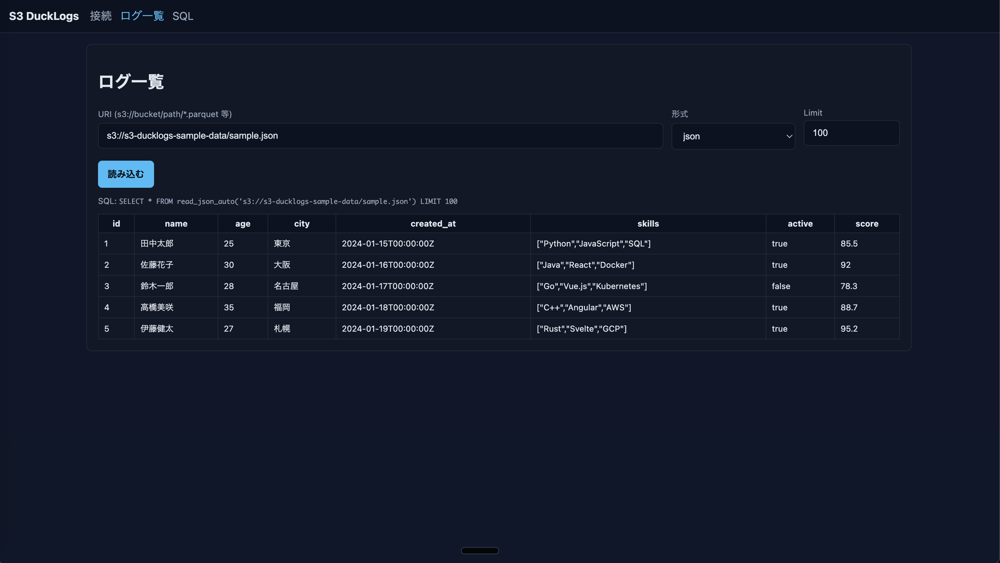
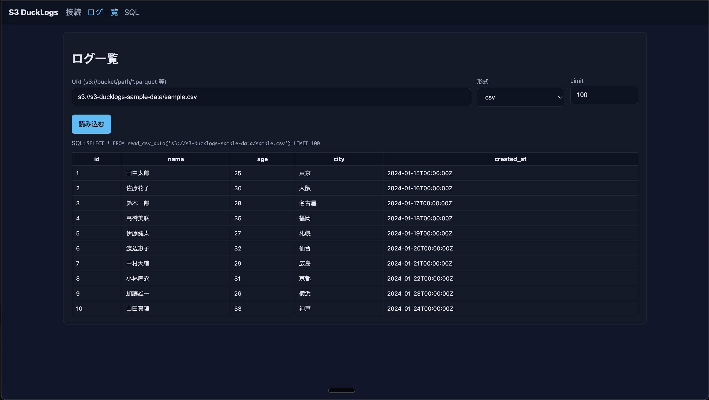
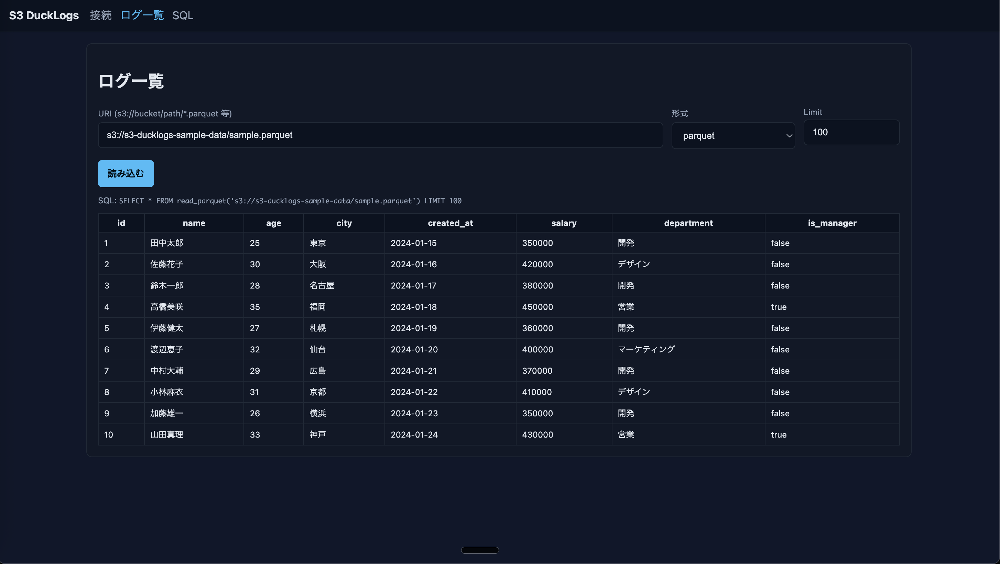

# S3 DuckLogs

軽量な S3 ログビューア MVP。DuckDB の httpfs 拡張で S3/互換ストレージ上の Parquet / JSONL / CSV を直接読み込み、React UI から閲覧・検索・SQL 実行できます。

## 特長

- 依存ゼロ感: Docker で即起動 / Go 単体バイナリでも動作
- Backend: Go 1.22 + net/http + go-duckdb
- DuckDB: httpfs を INSTALL/LOAD し S3 に直接アクセス（AWS_* 環境変数を使用）
- Frontend: React + Vite + TypeScript（最小 UI）

## ディレクトリ構成

```
s3-ducklogs/
├─ backend/
│  ├─ main.go
│  ├─ go.mod
│  ├─ Dockerfile
├─ frontend/
│  ├─ index.html
│  ├─ vite.config.ts
│  ├─ package.json
│  └─ src/
│     ├─ main.tsx
│     ├─ api.ts
│     ├─ App.tsx
│     └─ pages/
│        ├─ Connect.tsx
│        ├─ Logs.tsx
│        └─ SQL.tsx
├─ docker-compose.yml
├─ README.md
└─ LICENSE
```

## 前提

- Docker / docker-compose が利用可能
- AWS 認証情報は環境変数（AWS_ACCESS_KEY_ID, AWS_SECRET_ACCESS_KEY, 任意で AWS_SESSION_TOKEN, AWS_REGION）で提供

## セットアップ & 起動

1) リポジトリ取得

- 初回: git clone しディレクトリに移動

2) Docker で起動

```
# ホストに AWS_* を設定しておく
export AWS_ACCESS_KEY_ID=...
export AWS_SECRET_ACCESS_KEY=...
export AWS_REGION=ap-northeast-1   # 任意

# 起動
docker compose up --build
```

- Backend: <http://localhost:8080>
- Frontend: <http://localhost:5173>

3) Go 単体で起動（任意）

```
cd backend
# DuckDB ライブラリが必要（Debian/Ubuntu: sudo apt install libduckdb-dev libduckdb0）
go run .
```

## サンプルデータ

テスト用のサンプルデータが sample_data に用意されています：

### 利用可能なファイル

| ファイル | 形式 | サイズ | 説明 |
|---------|------|--------|------|
| `sample.csv` | CSV | 392B | 10件のユーザーデータ（id, name, age, city, created_at） |
| `sample.json` | JSON | 1.1KB | 5件の詳細ユーザーデータ（スキル情報、アクティブ状態、スコア付き） |
| `sample.parquet` | Parquet | 5.3KB | 10件のユーザーデータ（給与、部署、マネージャー情報付き） |

### サンプルデータの使用例

```sql
-- CSVファイルの読み込み
SELECT * FROM read_csv_auto('s3://s3-ducklogs-sample-data/sample.csv') LIMIT 5;

-- JSONファイルの読み込み
SELECT name, skills FROM read_json_auto('s3://s3-ducklogs-sample-data/sample.json') WHERE active = true;

-- Parquetファイルの読み込み
SELECT name, department, salary FROM read_parquet('s3://s3-ducklogs-sample-data/sample.parquet') WHERE is_manager = true;
```


*S3からJSONファイルを読み込んで表示している画面*


*S3からCSVファイルを読み込んで表示している画面*


*S3からParquetファイルを読み込んで表示している画面*

## フロントエンドの使い方

- 画面A「接続」: Region/Endpoint を入力して適用
- 画面B「ログ一覧」: s3:// 形式の URI とフォーマット、Limit を指定して読み込み
- 画面C「SQL」: 任意の SQL を実行

## API 一覧（MVP）

- POST /connect
  - 入力例: {"s3_region":"ap-northeast-1","s3_endpoint":"任意"}
  - 動作: DuckDB に httpfs 設定（SET s3_region/s3_endpoint）
  - 出力: {"ok":true,"message":"httpfs configured"}

- POST /quick
  - 入力例: {"uri":"s3://bucket/logs/*.parquet","format":"parquet","limit":100}
  - 動作: read_parquet / read_json_auto / read_csv_auto のいずれかで読み込み、LIMIT 件返却
  - 出力例: {"rows":[...],"columns":[...],"sql":"実行SQL"}

- POST /query
  - 入力例: {"sql":"SELECT * FROM ... LIMIT 10"}
  - 動作: 任意 SQL を実行し結果返却
  - 出力例: {"rows":[...],"columns":[...]}

### ヘルスチェック

- GET /health -> {"status":"ok","time":"..."}

## 設計メモ

- DuckDB はサーバ起動時に `INSTALL httpfs; LOAD httpfs;` を実行
- 認証は DuckDB が環境変数の AWS_* を自動参照
- DB はメモリ上に作成（単一プロセス内で共有）。必要ならファイル永続化に変更可能
- CORS は簡易許可（ブラウザからのアクセス用）。本番運用では制限推奨

## よくある質問

- JSONL の指定は format=json/jsonl/ndjson のいずれでも可（read_json_auto を利用）
- MinIO 等 S3 互換の利用時は endpoint を指定し、必要に応じて `AWS_REGION` も設定

## ライセンス

本プロジェクトは MIT ライセンスです。詳しくは LICENSE を参照してください。
